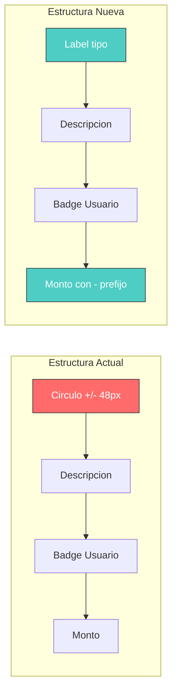

# Plan: Solucionar Desbordamiento en Últimos Movimientos (Vista Móvil)

## Problema Identificado

En la sección "Últimos Movimientos" del Dashboard, los elementos desbordan hacia la derecha en vista móvil. El componente [`RecentMovements`](src/pages/admin/crm/Dashboard.jsx:148) tiene una estructura que consume demasiado espacio horizontal.

### Causa Principal

El círculo con el signo +/- en cada movimiento tiene las siguientes dimensiones:
- Tamaño: `w-12 h-12` (48px × 48px)
- Gap adicional: `gap-5` (20px)
- **Total: ~68px de ancho**

Esto, sumado a la descripción, badge de usuario, cuotas, monto y categoría, excede el ancho disponible en pantallas móviles.

## Solución Propuesta

Eliminar el círculo grande con el signo +/- y reemplazarlo por un pequeño label/badge que indique el tipo de movimiento (INGRESO, GASTO, PENDIENTE). Además, agregar un prefijo "-" antes del monto para movimientos de tipo GASTO.

### Beneficios

1. **Ahorro de espacio**: ~68px por fila (eliminando el círculo)
2. **Más informativo**: El label indica claramente el tipo de movimiento
3. **Claridad visual**: El color del label + prefijo "-" para gastos refuerza la información
4. **Diseño más limpio**: Menos elementos visuales compitiendo por atención

## Cambios a Realizar

### Archivo: `src/pages/admin/crm/Dashboard.jsx`

#### 1. Eliminar el círculo con signo y reemplazar por un pequeño label/badge

**Antes (líneas 203-211):**
```jsx
<div className="flex items-center gap-5">
    <div className={`w-12 h-12 rounded-full flex items-center justify-center font-black ${mov.type === 'INGRESO' ? '...' : '...' } shadow-inner`}>
        {mov.status === 'PENDING' ? <Clock className="w-5 h-5 text-amber-500" /> : ...}
    </div>
    <div>
        <div className="flex items-center gap-2 mb-1">
            <p className="font-black text-slate-800 italic text-lg tracking-tight leading-none">{mov.description || 'Sin descripción'}</p>
            ...
```

**Después:**
```jsx
<div className="flex items-center gap-3">
    <div>
        <div className="flex items-center gap-2 mb-1">
            {/* Nuevo label/badge pequeño para tipo de movimiento */}
            <span className={`text-[8px] font-black px-2 py-0.5 rounded-full uppercase tracking-tighter ${
                mov.status === 'PENDING' 
                    ? 'bg-amber-100 dark:bg-amber-500/10 text-amber-600 dark:text-amber-400 border border-dashed border-amber-300'
                    : mov.type === 'INGRESO' 
                        ? 'bg-emerald-100 dark:bg-emerald-500/10 text-emerald-600 dark:text-emerald-400'
                        : mov.type === 'GASTO' 
                            ? 'bg-rose-100 dark:bg-rose-500/10 text-rose-600 dark:text-rose-400'
                            : mov.type === 'EMERGENCIA' 
                                ? 'bg-amber-100 dark:bg-amber-500/10 text-amber-600 dark:text-amber-400'
                                : mov.type === 'AHORRO' 
                                    ? 'bg-brand-100 dark:bg-brand-200 text-brand dark:text-brand-dark'
                                    : 'bg-slate-100 dark:bg-slate-200 text-slate-600 dark:text-slate-700'
            }`}>
                {mov.status === 'PENDING' ? 'PENDIENTE' : mov.type}
            </span>
            <p className="font-black text-slate-800 italic text-lg tracking-tight leading-none">{mov.description || 'Sin descripción'}</p>
            ...
```

#### 2. Agregar prefijo "-" al monto para GASTO (líneas 234-240)

**Antes:**
```jsx
<p className={`text-xl font-black tracking-tighter italic ${mov.type === 'INGRESO' ? 'text-emerald-600 dark:text-emerald-400' :
    mov.type === 'GASTO' ? 'text-rose-600 dark:text-rose-400' :
        mov.type === 'EMERGENCIA' ? 'text-amber-600 dark:text-amber-400' :
            mov.type === 'AHORRO' ? 'text-brand' :
                'text-slate-600 dark:text-slate-400'
    }`}>
    {formatCurrency(mov.amount)}
</p>
```

**Después:**
```jsx
<p className={`text-xl font-black tracking-tighter italic ${mov.type === 'INGRESO' ? 'text-emerald-600 dark:text-emerald-400' :
    mov.type === 'GASTO' ? 'text-rose-600 dark:text-rose-400' :
        mov.type === 'EMERGENCIA' ? 'text-amber-600 dark:text-amber-400' :
            mov.type === 'AHORRO' ? 'text-brand' :
                'text-slate-600 dark:text-slate-400'
    }`}>
    {mov.type === 'GASTO' ? '-' : ''}{formatCurrency(mov.amount)}
</p>
```

## Diagrama de Cambios



## Consideraciones Adicionales

### Label de tipo de movimiento
- El nuevo label muestra: INGRESO, GASTO, EMERGENCIA, AHORRO o PENDIENTE
- Para PENDIENTE, el label tiene borde punteado amber para mayor visibilidad
- El tamaño es compacto: `text-[8px]` con `px-2 py-0.5`

### Para movimientos PENDIENTE
- El label muestra "PENDIENTE" en lugar del tipo
- El borde punteado amber se mantiene en el contenedor
- El botón de confirmar (CheckCircle) se mantiene a la derecha

### Para movimientos GASTO
- El label dice "GASTO" en color rose
- El monto tiene prefijo "-" y color rose
- Doble indicación visual de que es un gasto

## Pruebas a Realizar

1. Verificar en Chrome DevTools con vista móvil (375px, 414px)
2. Comprobar que no hay scroll horizontal
3. Verificar que los labels de tipo se ven claros
4. Confirmar que el prefijo "-" se muestra para GASTO
5. Verificar que el diseño general se mantiene coherente
6. Probar en localhost:5173
